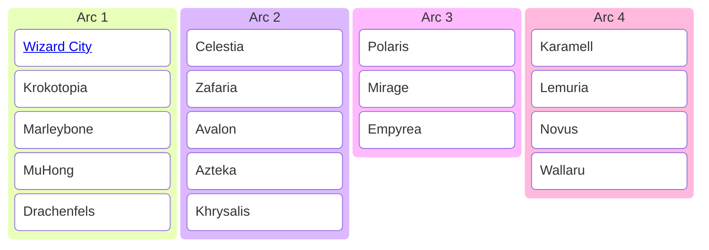

Ravenpedia ist ein Community-Projekt zum Aufbau einer deutschsprachigen Wissensdatenbank und Guidesammlung rund um [**Wizard101**](https://eu.wizard101.com/de_DE/game). Als Community-Wiki wächst Ravenpedia stetig weiter und bündelt alle wichtigen Infos zum Massen-Mehrspieler-Online-Rollenspiel Wizard101 von [KingsIsle Entertainment](https://www.kingsisle.com/) – von Quests und Zaubern über Ausrüstung bis hin zu den verschiedenen Welten.
## Grundlagen

Hier findest du alles, was dir den Einstieg in Wizard101 erleichtert. Von den ersten Schritten in Wizard City über die Benutzeroberfläche bis hin zu Tipps für Kämpfe und das Sammeln von Ressourcen.

- [[Grundlagen/Erste Schritte|Erste Schritte]] | Dein Anfang als Zauberin oder Zauberer in der Spirale  
- [[Grundlagen/Kampfsystem|Das Kampfsystem]] | Wie Karten, Pips und Zauber funktionieren  
- [[Grundlagen/Interface|Benutzeroberfläche]] | Zauberbuch, Rucksack und die wichtigsten Menüs  
- [[Grundlagen/Währung|Währungen]] | Gold, Kronen und ihre Verwendung  
- [[Grundlagen/Handwerk|Handwerk & Rezepte]] | wie du Ausrüstung und Karten selbst herstellst  
- [[Grundlagen/Haustiere|Haustiere & Spiele]] | Begleiter, Training und Talente  
- [[Grundlagen/Reittiere|Reittiere]] | schneller durch die Welten reisen  
## Die Welten der Spirale

Die Geschichte von Wizard101 ist in sogenannte Arcs (Handlungsbogen, ein Abschnitt einer Geschichte) unterteilt. Jeder Arc umfasst mehrere Welten, die zusammen eine größere Handlung ergeben. So kannst du die Reise der Spirale besser einordnen:

### Arc 1 – Die Tragödie von Malistaire

Deine Reise beginnt als Schülerin oder Schüler in der [[Welten/Wizard City/Rabenhain/index|Rabenhain Akademie]] von [[Welten/Wizard City/index|Wizard City]]. Dort zeigt sich schnell, dass der abtrünnige Professor [[Malistaire]] dunkle Pläne verfolgt. Auf der Suche nach verbotener Magie führt er dich von den Pyramiden [[Welten/Krokotopia/index|Krokotopias]] über die Straßen [[Welten/Marleybone/index|Marleybones]] bis in das friedliche Kaiserreich [[Welten/MuHong/index|MuHong]]. Schließlich erreichst du [[Welten/Drachenfels/index|Drachenfels]], ein verwüstetes Land voller feuerspeiender Kreaturen und uralter Geheimnisse. Dort kommt es zum entscheidenden Kampf gegen [[Malistaire]], der aus Trauer um seine verstorbene Frau bereit ist, die [[Welten/index|Spirale]] ins Chaos zu stürzen.
### Arc 2 – Die Fäden von Morganthe

Nach Malistaires Sturz erhebt sich eine neue Bedrohung: die Zauberin [[Morganthe]]. Sie strebt nach der Herrschaft über die Spirale und versucht, mit den Geheimnissen der [[Schattenmagie]] ihr Ziel zu erreichen. Deine Reise führt dich in die versunkenen Ruinen von [[Welten/Celestia/index|Celestia]], weiter in die weiten Ebenen [[Welten/Zafaria/index|Zafarias]] und die mythischen Wälder von [[Welten/Avalon/index|Avalon]]. Von dort gelangst du in das uralte, vom Untergang bedrohte Reich [[Welten/Azteka/index|Azteka]], ehe sich in [[Welten/Khrysalis/index|Khrysalis]] der finale Kampf gegen Morganthe entscheidet. Mit diesem Arc weitet sich die Geschichte der Spirale und enthüllt erstmals das ganze Ausmaß ihrer dunklen Mächte.
### Arc 3 – Das Netz von Großvater Spinne

Mit dem Fall Morganthes scheint die Spirale kurzzeitig zur Ruhe zu kommen, doch eine noch ältere Macht erwacht. [[Großvater Spinne]], einer der Schöpfer der Spirale, kehrt aus seiner Verbannung zurück. Zusammen mit seinen Kindern – [[Die Ratte]], [[Die Fledermaus]] und [[Der Skorpion]] – spinnt er ein Netz, das ganze Welten zu verschlingen droht. Deine Reise führt dich von den eisigen Ebenen [[Welten/Polaris/index|Polaris]] über die glühenden Wüsten [[Welten/Mirage/index|Mirages]] bis in die geheimnisvollen Himmelsinseln von [[Welten/Empyrea/index|Empyrea]]. Dort entscheidet sich, ob die Spirale dem Willen ihrer Schöpfer verfällt oder ihren eigenen Weg gehen kann.
### Arc 4 – Das Rätsel des Daseins

Nach den Erschütterungen durch Großvater Spinne richten sich neue Fragen an die Natur der Spirale selbst. Deine Suche beginnt im süßen, doch trügerischen Land [[Welten/Karamell/index|Karamell]], führt dich in die zersplitterte Welt [[Welten/Lemuria/index|Lemuria]] und weiter nach [[Welten/Novus/index|Novus]], wo Realität und Vorstellung verschwimmen. Schließlich erreichst du [[Welten/Wallaru/index|Wallaru]], eine ferne Welt, die Antworten auf die Zukunft der Spirale verspricht. Dieser Arc erzählt von Identität, Ordnung und Chaos – und markiert den Beginn einer neuen Ära der Spirale.
### Nebenwelten und -gebiete

Neben den Hauptwelten gibt es Nebenwelten und -gebiete. Sie sind nicht Teil der großen Handlungsbögen, bieten aber zusätzliche Quests, Dungeons und Ausrüstung.

> [!tip] Hinweis  
> Diese Bereiche der Spirale sind optional, lohnen sich aber oft wegen spezieller Belohnungen und einzigartiger Geschichten.  