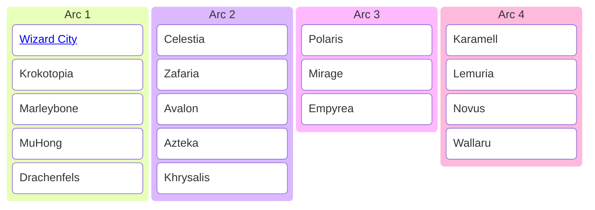

| Header 1 |     |
| -------- | --- |
| A        | B   |
| C        | D   |
|          |     |

<table>
  <tr>
    <td>Header 1</td>
    <td>Zelle B1</td>
  </tr>
  <tr>
    <td>Zelle A2</td>
    <td>Zelle B2</td>
  </tr>
</table>

